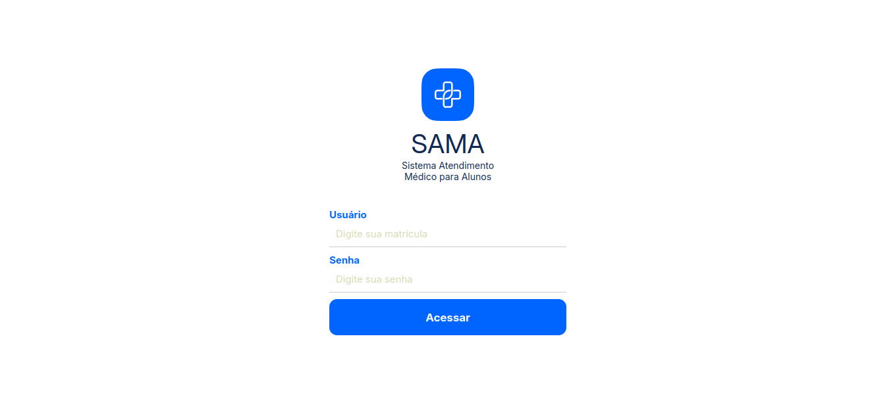
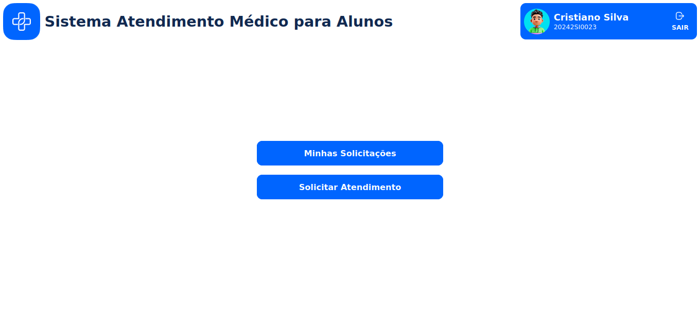
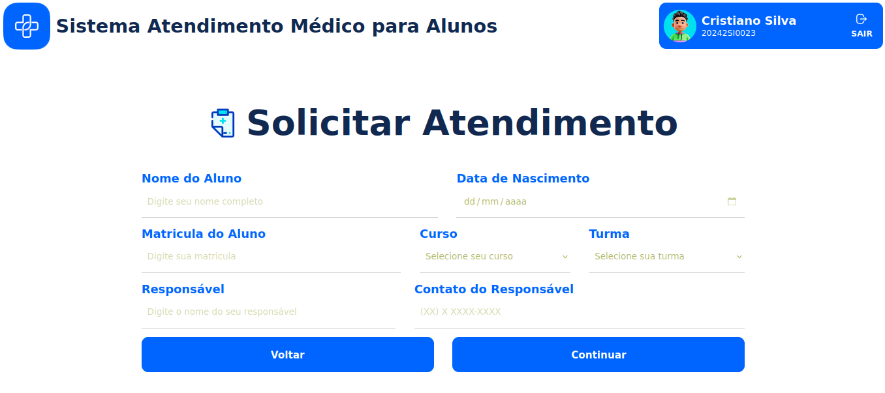
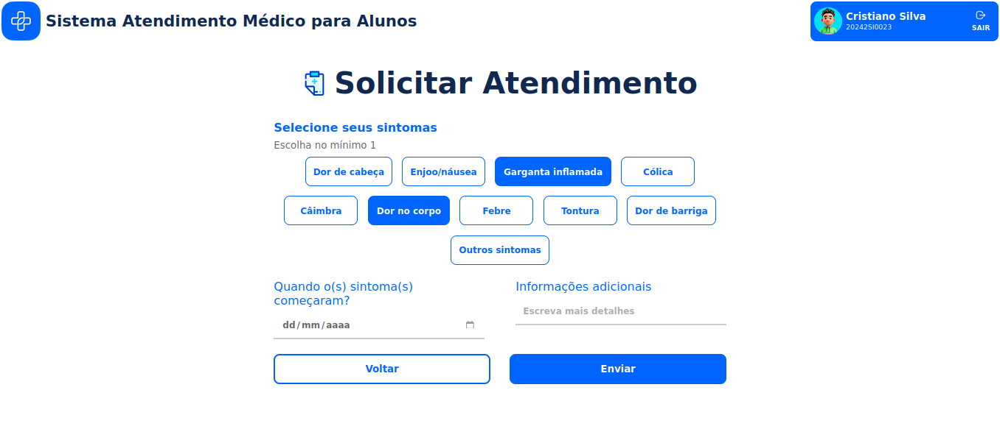
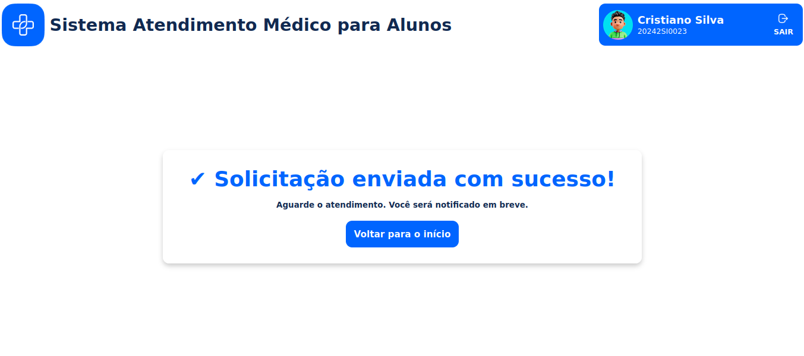

# Sistema de Atendimento Médico para Alunos

Este repositório contém um mock de front-end para um sistema de gestão de atendimentos médicos no Instituto Federal do Monte Castelo. O projeto foi desenvolvido como parte da disciplina de Programação Extrema.

## 📌 Problema
Atualmente, o Departamento Médico do instituto enfrenta dificuldades na gestão e registro dos atendimentos aos alunos. O processo manual pode resultar em:
- Registros imprecisos ou incompletos;
- Dificuldade na recuperação de informações passadas;
- Falta de um histórico consolidado para acompanhamento dos alunos.

Essa situação compromete a eficiência do atendimento e a organização dos dados médicos dos estudantes.

## 💡 Solução
Para resolver esses problemas, este projeto propõe o desenvolvimento de um **Sistema de Atendimento Médico para Alunos**, que permite:
- Registro digital e seguro dos atendimentos;
- Acesso rápido ao histórico dos alunos;
- Emissão automatizada de relatórios detalhados.

Com essa solução, buscamos proporcionar mais **organização, agilidade e precisão** no atendimento prestado aos alunos.

## 🏗️ Estrutura do Mock Front-End
O mock apresenta páginas básicas simulando a interface do sistema, incluindo:
- Tela de login;
- Página inicial com opções de navegação;
- Formulário para solicitação de atendimento;
- Histórico de atendimentos dos alunos.

## Imagens do Mock

  
  
  
  
  

